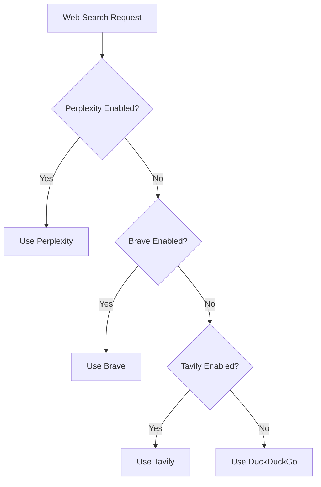

PicoClaw provides web search capabilities through multiple search providers with intelligent fallback behavior. The agent can search the web to find current information, news, and answers to questions.

## Available Providers

PicoClaw supports four web search providers with automatic priority-based selection:

### 1. Perplexity (Priority 1)

**Best for:** AI-powered search with synthesized answers

- Uses Perplexity's `sonar` model for intelligent search
- Returns formatted results with titles, URLs, and descriptions
- Slower than traditional search (30s timeout) due to LLM processing
- Requires API key from [Perplexity](https://perplexity.ai)

### 2. Brave Search (Priority 2)

**Best for:** High-quality search results optimized for AI agents

- Fast and reliable search results (10s timeout)
- Free tier: 2,000 queries per month
- Requires API key from [Brave Search API](https://brave.com/search/api)
- Returns structured results with titles, URLs, and descriptions

### 3. Tavily (Priority 3)

**Best for:** AI-optimized search with advanced depth

- Designed specifically for AI agents
- Free tier: 1,000 queries per month  
- Requires API key from [Tavily](https://tavily.com)
- Advanced search depth with rich content extraction

### 4. DuckDuckGo (Priority 4 - Fallback)

**Best for:** No-setup fallback option

- No API key required
- Free and unlimited
- HTML-based extraction using regex
- Automatically enabled as fallback when no other provider is configured

## Configuration

Add web search configuration to `~/.picoclaw/config.json`:

```json
{
  "tools": {
    "web": {
      "perplexity": {
        "enabled": true,
        "api_key": "pplx-...",
        "max_results": 5
      },
      "brave": {
        "enabled": true,
        "api_key": "BSA...",
        "max_results": 5
      },
      "tavily": {
        "enabled": true,
        "api_key": "tvly-...",
        "max_results": 5
      },
      "duckduckgo": {
        "enabled": true,
        "max_results": 5
      }
    }
  }
}
```

### Configuration Options

| Option | Type | Default | Description |
|--------|------|---------|-------------|
| `enabled` | boolean | `false` | Enable/disable the provider |
| `api_key` | string | - | API key for the provider (not needed for DuckDuckGo) |
| `max_results` | integer | `5` | Maximum number of search results to return |

## Fallback Behavior

PicoClaw automatically selects the best available provider based on priority:

1. **Perplexity** - If enabled and API key is configured
2. **Brave** - If Perplexity unavailable and Brave is enabled
3. **Tavily** - If Brave unavailable and Tavily is enabled  
4. **DuckDuckGo** - Always available as ultimate fallback (no API key needed)



## Usage

The agent automatically uses web search when needed:

```bash
picoclaw agent -m "What are the latest AI news?"
```

The `web_search` tool is invoked automatically by the agent with the following parameters:

### Tool Parameters

| Parameter | Type | Required | Description |
|-----------|------|----------|-------------|
| `query` | string | Yes | Search query |
| `count` | integer | No | Number of results (1-10, default: configured max_results) |

### Tool Response Format

The tool returns formatted search results:

```
Results for: AI news (via Brave)
1. Latest AI Developments
   https://example.com/ai-news
   Breaking news about artificial intelligence...

2. AI Industry Update
   https://example.com/industry
   Major tech companies announce new AI initiatives...
```

## Getting API Keys

### Brave Search API

1. Visit [https://brave.com/search/api](https://brave.com/search/api)
2. Sign up for a free account
3. Create an API key (starts with `BSA`)
4. Free tier: 2,000 queries/month

### Tavily API

1. Visit [https://tavily.com](https://tavily.com)
2. Sign up for an account
3. Get your API key (starts with `tvly-`)
4. Free tier: 1,000 queries/month

### Perplexity API

1. Visit [https://perplexity.ai](https://perplexity.ai)
2. Access API settings
3. Generate API key (starts with `pplx-`)
4. Check pricing at [Perplexity Pricing](https://perplexity.ai/pricing)

## Minimal Setup (No API Key)

To use web search without any API keys, simply enable DuckDuckGo:

```json
{
  "tools": {
    "web": {
      "duckduckgo": {
        "enabled": true,
        "max_results": 5
      }
    }
  }
}
```

This configuration is **automatically enabled by default** if no other providers are configured.

## Implementation Details

### Search Timeouts

- **Standard providers** (Brave, Tavily, DuckDuckGo): 10 seconds
- **Perplexity**: 30 seconds (due to LLM processing)
- **Web fetch**: 60 seconds

### HTTP Client Features

- Configurable proxy support (HTTP, HTTPS, SOCKS5)
- Connection pooling (10 max idle connections)
- 30-second idle connection timeout
- 15-second TLS handshake timeout
- Custom User-Agent for compatibility

### Provider Implementation

All providers implement the `SearchProvider` interface:

```go
type SearchProvider interface {
    Search(ctx context.Context, query string, count int) (string, error)
}
```

## Troubleshooting

### "API key configuration issue"

This message appears when no API key is configured. The agent will:
- Automatically fall back to DuckDuckGo if enabled
- Provide helpful links for manual searching

### "No results found"

If a search returns no results:
- Try rephrasing the query
- Check internet connectivity
- Verify API key is valid
- Try a different provider

### Rate Limiting

Free tier limits:
- **Brave**: 2,000 queries/month
- **Tavily**: 1,000 queries/month
- **DuckDuckGo**: Unlimited (rate-limited by IP)

When you hit the limit, PicoClaw automatically falls back to the next available provider.

## Related Tools

- [Web Fetch](/features/web-fetch) - Fetch and extract content from specific URLs
- [Scheduled Tasks](/features/scheduled-tasks) - Schedule periodic web searches